## Como engadir recursos a Social Sciences and Humanities Open Marketplace (SSHOM)

Esta documentación foi traducida e adapatado polo equipo de [CLARIAH-GAL](https://www.clariah.gal/) a partir da guía elaborada pola Universidade das Palmas de Gran Canaria (ULPGC)

## Creación dunha conta e acceso: 
Accederemos a https://marketplace.sshopencloud.eu/. Na esquina superior dereita, veremos a opción de rexistrarnos. A través do botón "Sign in", iniciaremos o proceso de creación da conta.  
 
 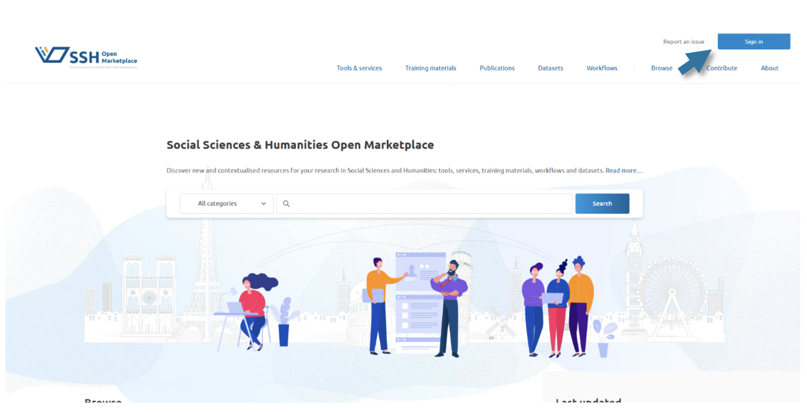
 
A interface vainos dar a posibilidade de iniciar sesión como usuarios a través de contas institucionais ou como administradores da páxina. Nós usaremos sempre o primeiro método.  
 
 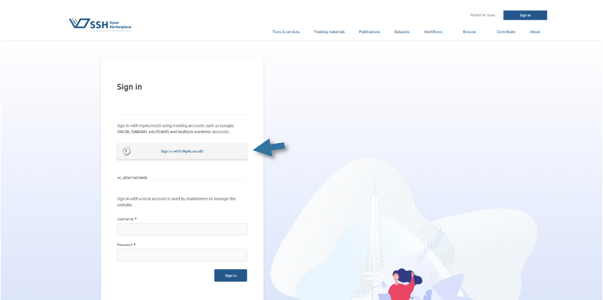
 
Para identificarnos como usuario podemos usar unha conta eIDAS, Google, ORCID ou a nosa conta institucional vinculada a una universidade española, membro de 
CLARIAH-ES. Neste manual, recomendamos usar as credenciais universitarias. 

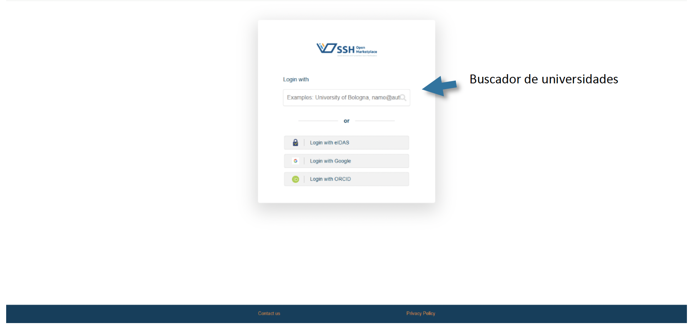
 
Buscaremos o nome da nosa universidade; neste exemplo aparece a Universidad de Las Palmas de Gran Canaria (ULPGC), e faremos clic na opción correspondente. 

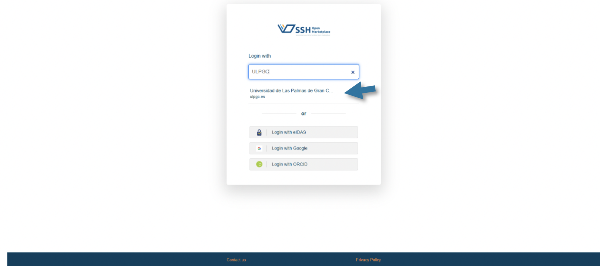
 
A plataforma redirixirase á pantalla de inicio de sesión da nosa universidade: usaremos o noso usuario e contrasinal como facemos habitualmente para acceder aos servicios da nosa institución. 

 
Unha vez completado este paso, SSH Open Marketplace identificaranos como membros dunha universidade pertencente a CLARIAH-ES, o que nos permitirá crear unha conta. Amosaranse os nosos datos principais e solicitaránsenos algúns permisos, como a aceptación dos termos e condicións e da política de tratamento de datos. Se estamos de acordo, confirmaremos marcando as casiñas correspondentes.

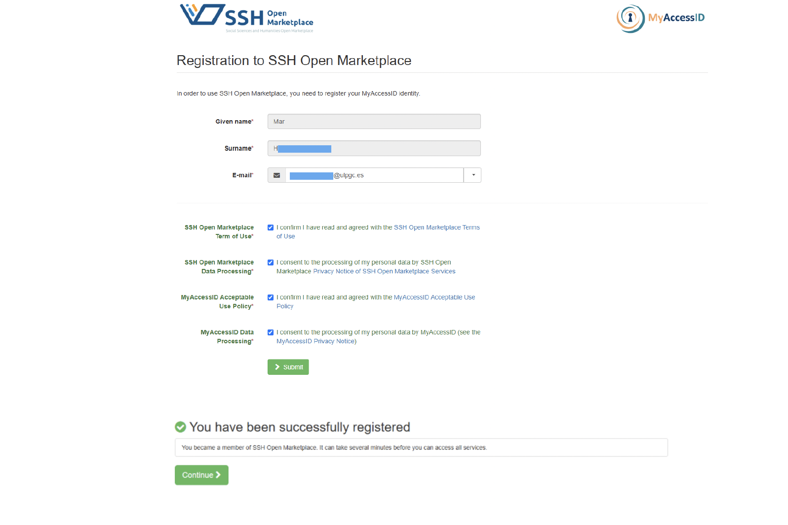

 
Neste punto, redirixiranos de volta á páxina principal de SSH Open Marketplace para completar o rexistro desde alí. Voltaremos aceptar a súa política de privacidade e remataremos o proceso de inscrición facendo clic en "Sign up".
 
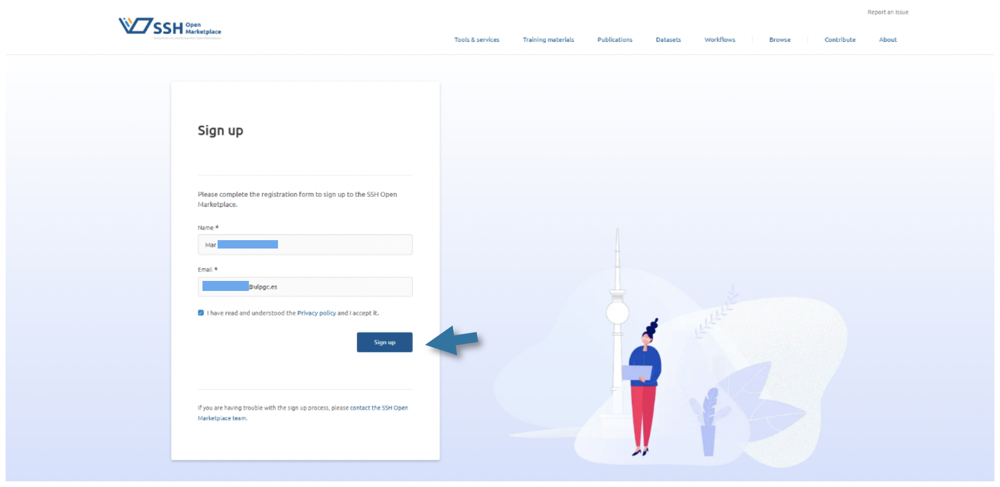
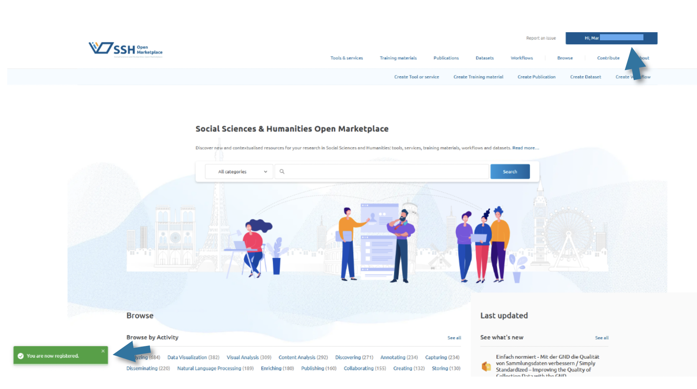
 
 
Solo tendremos que realizar este procedimiento una vez. De ahora en adelante, será 
suficiente con introducir nuestras credenciales institucionales.

Só teremos que realizar este procedemento unha vez. A partir de agora, será suficiente con introducir as nosas credenciais institucionais.

## Paso a paso: cómo subir un recurso 
Fai clic na opción correspondente ao tipo de recurso que desexas engadir ao SSH  Open Marketplace: Create tool or service, Create Training Material, Create Publication, Create Dataset ou Create Workflow.

Neste caso, como imos engadir unha ferramenta web, seleccionaremos a primeira opción: “Create tool or service”.

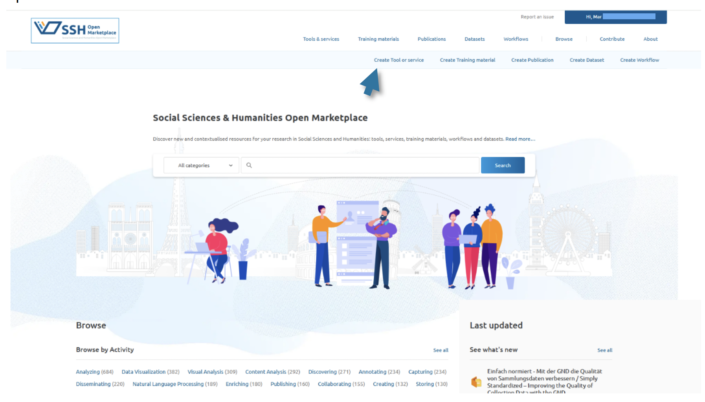

Esta opción abrirá un formulario con múltiples apartados. Aqueles que son obrigatorios están indicados cun asterisco (\*)

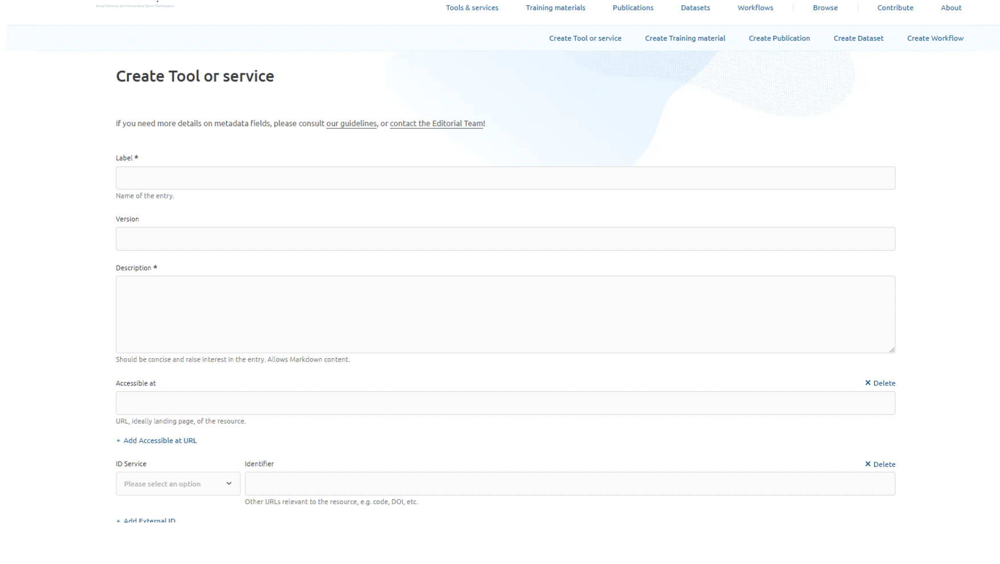

1) **Label**: neste campo debe indicarse o título do recurso que se vai rexistrar. É  importante que sexa breve, claro e conciso para facilitar a súa identificación. Recoméndase empregar o nome orixinal do recurso, coa ortografía correcta e respectando o uso de maiúsculas e minúsculas.

2) **Version**: corresponde á versión específica do recurso que se está a referenciar no SSH Open Marketplace, por exemplo: versión 1.0 ou versión 2.0.

3) **Description**: aquí debe redactarse unha definición breve do recurso. O seu obxectivo é espertar o interese do usuario e ofrecer unha idea xeral das súas funcionalidades. Non debe ser demasiado extensa e recoméndase encarecidamente escribila en inglés.

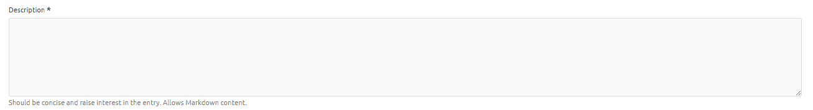

4) **Accesible at**: neste apartado debe incluírse a ligazón á páxina web do recurso ou ao seu identificador persistente, en formato URL. É fundamental asegurarse de que a ligazón funcione correctamente. Cando sexa posible, recoméndase o uso de identificadores persistentes como DOI ou Handle. Por exemplo, para artigos de investigación recoméndase a subida nos respositorios institucionais das universidades e para conxuntos de datos o uso de plataformas que ofrezcan estes identificadores como Zenodo ou Figshare. Non se recomenda o uso de plataformas propietarias como ResearchGate ou Arxiv. Para servizos web ou ferramentas con webs propias recoméndase o uso de sistemas como [w3id](https://w3id.org/), que permite a creación de identificadores persistentes para recursos dinámicos.

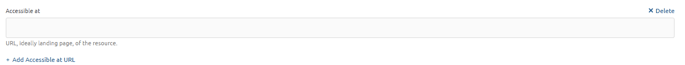

5) **ID service identifier**: neste caso engadirase esta información se corresponde. Poderá ser un valor repetido do punto anterior.

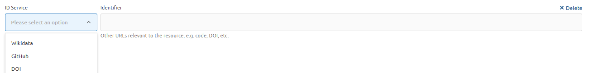

6) **Actors**: neste apartado deben indicarse as persoas e organizacións que 
contribuíron á creación do recurso. Ao engadir un actor, é obrigatorio incluír polo 
menos un nome.

**IMPORTANTE**: No caso da comunidade CLARIAH-ES, é obrigatorio incluír tres 
actores específicos:  
- **Contributor**: (nome da nosa institución ou universidade; p.ex., IATEXT)  
- **Reviewer**: CLARIAH-ES  
- **Curator**: DARIAH-EU

Unha vez engadidos estes tres actores, poderemos continuar incorporando 
información relevante, como o autor do recurso, que pode ser un ou varios 
investigadores da nosa institución.

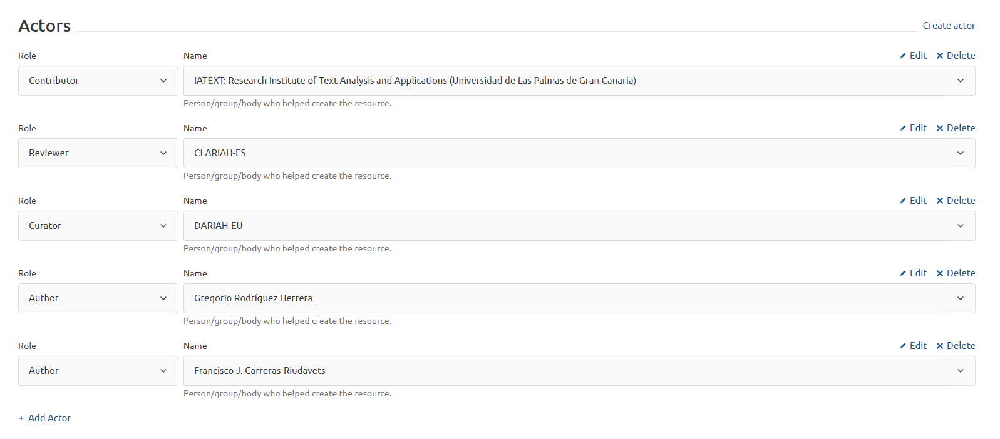

Como se mostra na imaxe, na esquina superior dereita aparece a opción 
*Create actor*. Esta función permite engadir como autor a unha persoa que aínda non 
está rexistrada na base de datos de autores do SSH Open Marketplace. Ao facer clic 
nesa opción, ábrese un formulario para crear unha nova ficha de autor. Unha vez 
completado, poderemos regresar ao formulario principal e seleccionalo como autor 
do recurso.

7) **Properties**: é o apartado máis extenso do formulario e contén múltiples opcións 
que se poden engadir ao recurso.

**IMPORTANTE**: No caso da comunidade CLARIAH-ES, será obrigatorio engadir na 
categoría “Keyword” o valor “DARIAH Resource”.

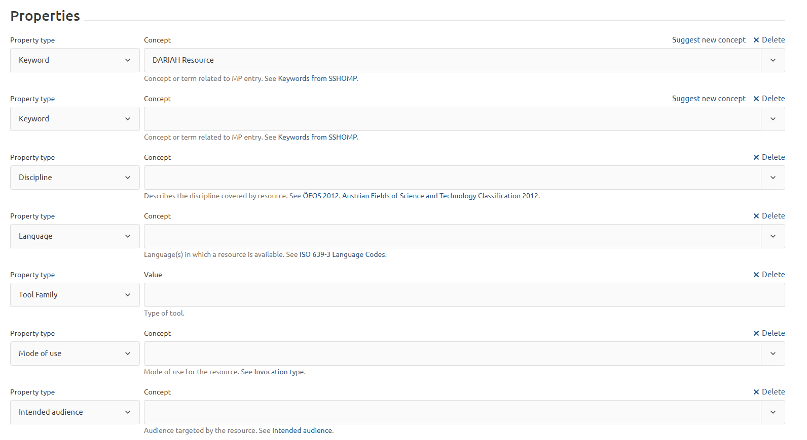

Ademais, recomendámosche cubrir os seguintes apartados (lembra que podes engadir 
tantas veces como queiras calquera dos metadatos para engadir nova información):  
- **Discipline**: disciplina(s) de estudo ás que se vincula o recurso.  
- **Language**: idioma(s) nos que está dispoñible o recurso.  
- **Mode of use**: forma na que se utiliza o recurso (por exemplo, acceso 
desde unha web, aplicación móbil, etc.).  
- **Intended audience**: público ao que está dirixido o recurso (por exemplo, 
estudantes, comunidade científica, etc.).  
- **Keywords**: inclúe tantas palabras clave como sexa posible, xa que isto 
aumentará as posibilidades de que o recurso apareza en distintas 
buscas. É recomendable consultar a ligazón “Keywords from SSHOMP”, que 
aparece baixo a barra de opcións. Alí pódense ver todas as palabras clave xa 
utilizadas no SSH Open Marketplace.

8) **Media**: pódense engadir imaxes ou vídeos. Recomendamos incluír capturas de 
pantalla da páxina de inicio da aplicación ou do sitio web.

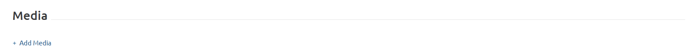

9) **Thumbnail**: engadiremos un logotipo do recurso, no caso de que exista. Se non 
proporcionamos ningún, aparecerá un logotipo xenérico de SSH Open Marketplace. 
Recoméndase que o logotipo teña unha resolución de 200x200 píxeles.

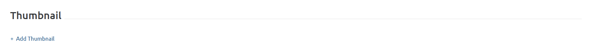

10) **Related items**: neste apartado poden indicarse as relacións que existan entre 
o recurso e outros elementos xa presentes no SSH Open Marketplace. Por exemplo, 
se hai un “Training Material” ou un “Dataset” vinculado ao recurso, pode especificarse 
aquí. Isto ofrece un contexto máis amplo ao usuario e facilita a navegación entre 
recursos relacionados dentro da plataforma.

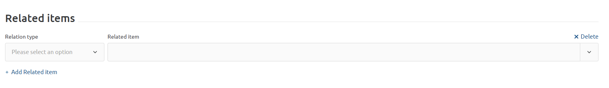

11) **Save as Draft** ou **Submit**: unha vez teñamos cuberto o formulario, poderemos 
facer clic no botón *Submit* para que sexa enviado aos moderadores e eles se 
encarguen de aprobalo e incluílo na plataforma. Se aínda non decidimos publicalo, 
podemos gardalo como borrador facendo clic en *Save as Draft* e acceder a el máis 
adiante.

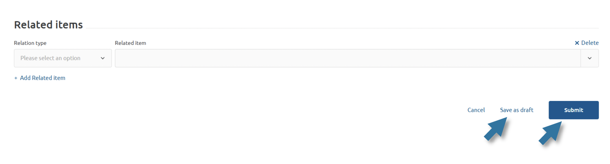

Poderemos acceder tanto aos nosos borradores como aos elementos 
publicados desde o apartado *My Account*.

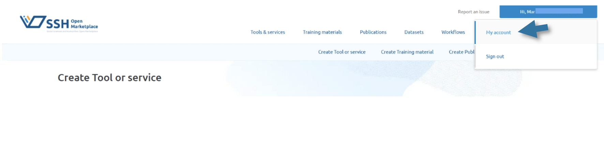  
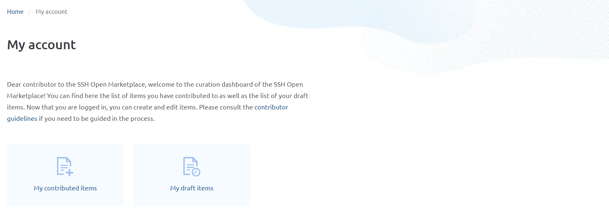

## Bibliografía 
SSH Open Marketplace. (s.f.). Metadata guidelines: Guidance for metadata fields. SSH Open 
Marketplace. Dispoñible en: https://marketplace.sshopencloud.eu/contribute/metadata-guidelines#guidance-for-metadata-fields [consulta: abril de 2025]

