## Guía de uso 
### Como engadir recursos a  Social Sciences and Humanities Open Marketplace (SSHOM)

## Creación dunha conta e acceso: 
Accederemos a https://marketplace.sshopencloud.eu/. Na esquina superior dereita, 
veremos a opción de rexistrarnos. A través do botón “Sign in”, iniciaremos o proceso 
de creación da conta.  
 
 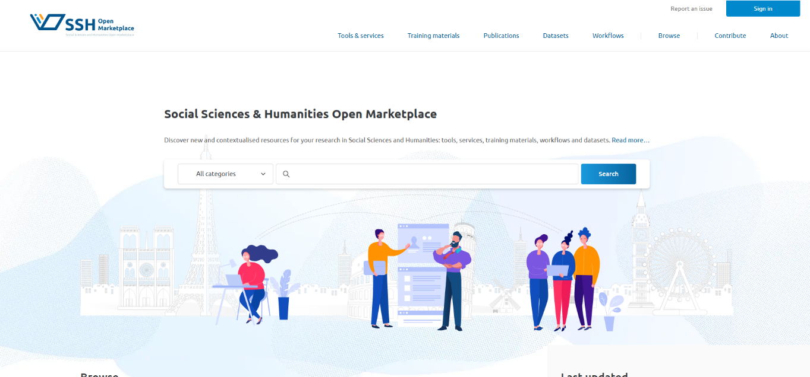
 
A interface vainos dar a posibilidade de iniciar sesión como usuarios a través de 
contas institucionais ou como administradores da páxina. Nós usaremos 
siempre o primeiro método.  
 
 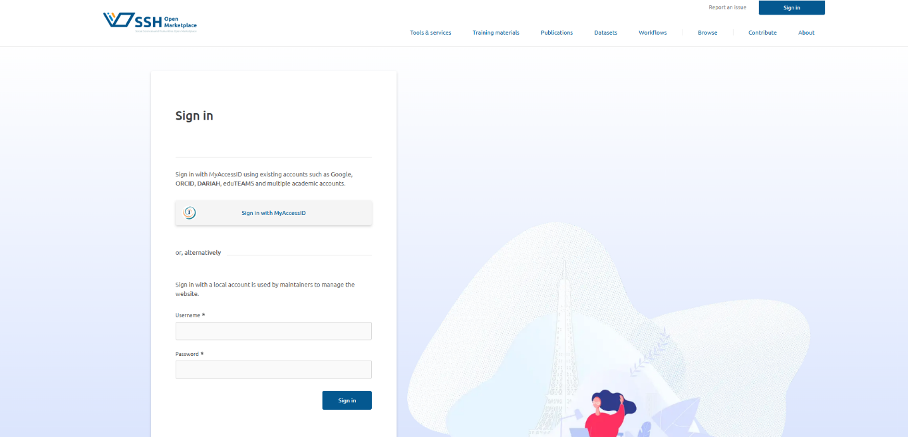
 
Para identificarnos como usuario podemos usar una cuenta eIDAS, Google, ORCID o 
nuestra cuenta institucional vinculada a una universidad española, miembro de 
CLARIAH-ES. En este manual, recomendamos usar as credenciais universitarias.

## Páxina 3

2 
 
  
 
Buscaremos o nome da nosa universidade; en este caso, la Universidad de Las 
Palmas de Gran Canaria (ULPGC), e faremos clic na opción correspondente. 
 
 
La plataforma redirixirase á pantalla de inicio de sesión de nuestra universidad: 
usaremos o noso usuario e contrasinal como lo hacemos habitualmente para acceder 
a los servicios de nuestra institución. 
 
Buscador de universidades

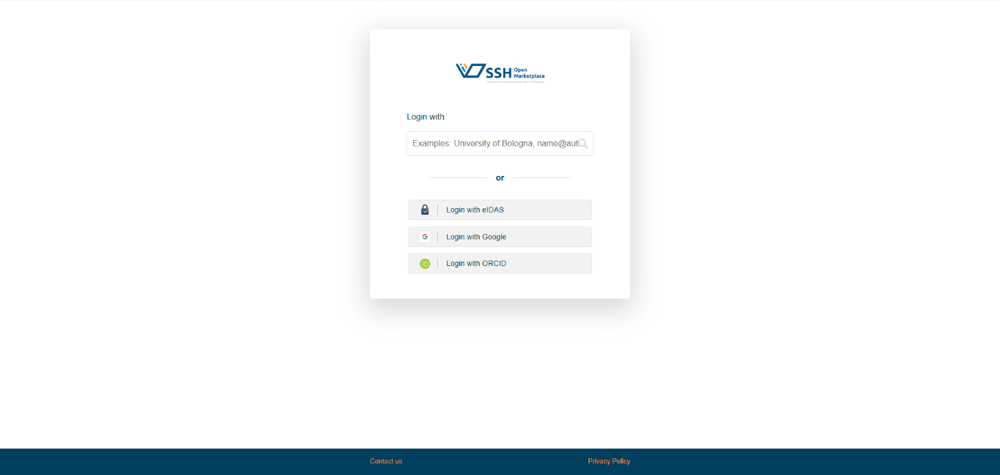
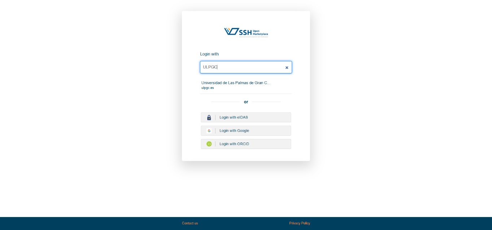

## Páxina 4

3 
 
  
 
Unha vez completado este paso, SSH Open Marketplace nos habrá identificado como 
miembros de una universidad perteneciente a CLARIAH-ES, lo que nos permitirá crear 
una cuenta. Mostraranse os nosos datos principais y se nos solicitarán algunos 
permisos, como la aceptación de los términos y condiciones y la política de 
procesamiento de datos. Si estamos de acuerdo, lo confirmaremos marcando las 
casillas correspondientes.

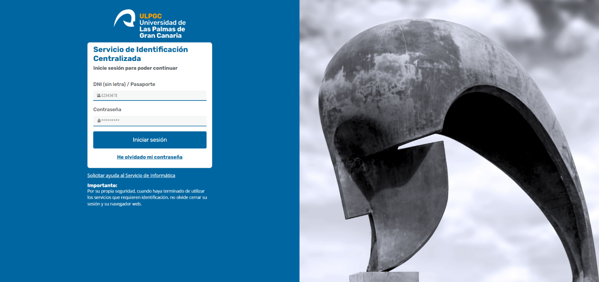
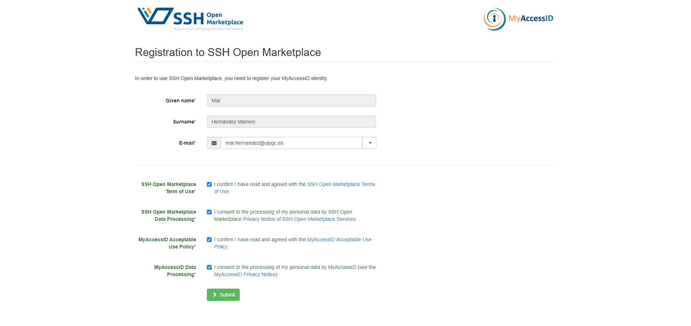
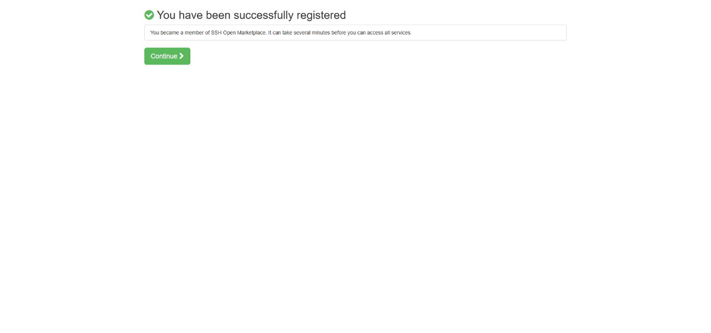

## Páxina 5

4 
 
En este punto, nos enviará de vuelta a la página principal de SSH Open Marketplace 
para completar el registro desde ahí. Voltaremos aceptar a súa política de privacidade 
y remataremos o proceso de inscrición al hacer clic en “Sign up”.  
 
 
 
 
 
Solo tendremos que realizar este procedimiento una vez. De ahora en adelante, será 
suficiente con introducir nuestras credenciales institucionales.

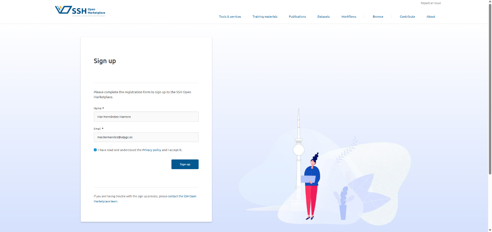
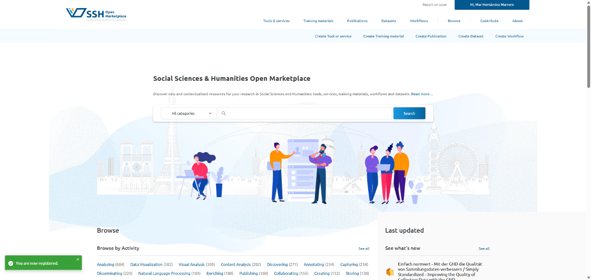

## Páxina 6

5 
 
Paso a paso: cómo subir un recurso 
Haz clic en la opción correspondiente al tipo de recurso que deseas añadir al SSH 
Open Marketplace: Create tool or service, Create Training Material, Create Publication, 
Create Dataset o Create Workflow. 
 
En este caso, como vamos a añadir una herramienta web, seleccionaremos la primera 
opción: “Create tool or service”. 
 
Esta opción abrirá un formulario con múltiples apartados. Aquellos que son 
obligatorios están indicados con asterisco (*)

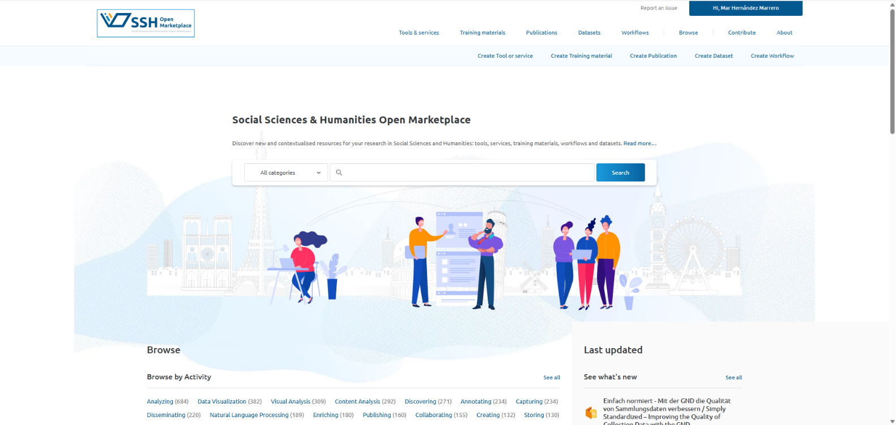
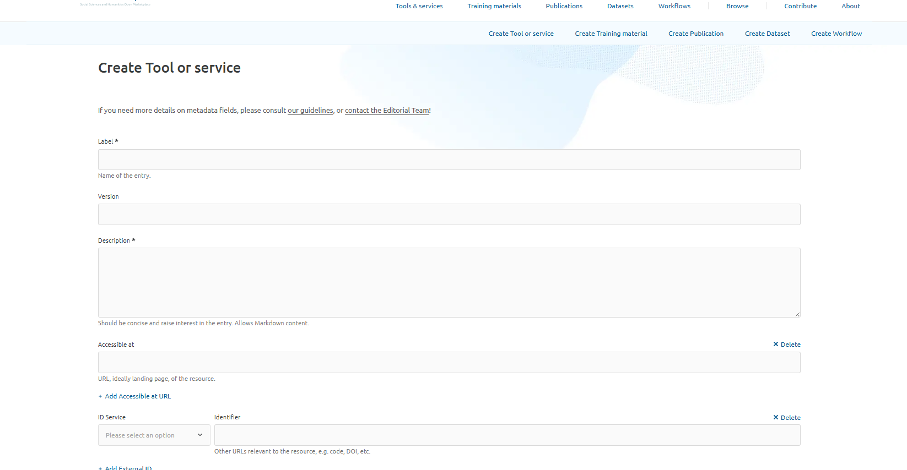

## Páxina 7

6 
 
1) Label: en este campo se debe indicar el título del recurso que se va a registrar. Es 
importante que sea breve, claro y conciso para facilitar su identificación. Se 
recomienda utilizar el nombre original del recurso, con la ortografía correcta y 
respetando el uso de mayúsculas y minúsculas. 
 
2) Version: corresponde a la versión específica del recurso que se está referenciando 
en el SSH Open Marketplace, por ejemplo: versión 1.0 o versión 2.0.
 
3) Description: aquí se debe redactar una definición breve del recurso. Su objetivo es 
despertar el interés del usuario y ofrecer una idea general de sus funcionalidades. No 
debe ser demasiado extensa y se recomienda encarecidamente escribirla en inglés. 
 
4) Accesible at: en este apartado se debe incluir el enlace a la página web del recurso 
o a su identificador persistente, en formato de URL. Es fundamental asegurarse de 
que el enlace funciona correctamente.  
 
5) ID service identifier: en este caso añadiremos esta información si corresponde. 
 
6) Actors: en este apartado se deben indicar las personas y organizaciones que han 
contribuido a la creación del recurso. Al añadir un actor, es obligatorio incluir al 
menos un nombre. 
IMPORTANTE: En el caso de la comunidad CLARIAH-ES, es obligatorio incluir tres 
actores específicos.  
• 
Contributor: (nombre de nuestra institución o universidad; p.e., IATEXT) 
• 
Reviewer: CLARIAH-ES 
• 
Curator: DARIAH-EU

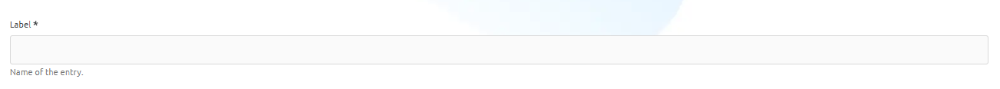
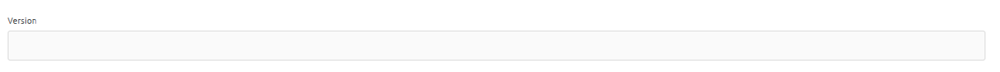

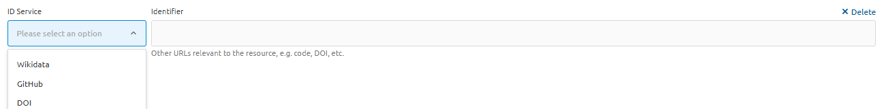

## Páxina 8

7 
 
Una vez añadidos estos tres actores, podremos continuar incorporando información 
relevante, como el autor del recurso, que puede ser uno o varios investigadores de 
nuestra institución. 
 
Como se muestra en la imagen, en la esquina superior derecha aparece la opción 
Create actor. Esta función permite añadir como autor a una persona que aún no está 
registrada en la base de datos de autores del SSH Open Marketplace. Al hacer clic 
en ese botón, se abre un formulario para crear una nueva ficha de autor. Una vez 
completada, podremos regresar al formulario principal y seleccionarlo como autor 
del recurso. 
 
 
7) Properties: es el apartado más extenso del formulario y contiene múltiples opciones 
que se pueden añadir al recurso.

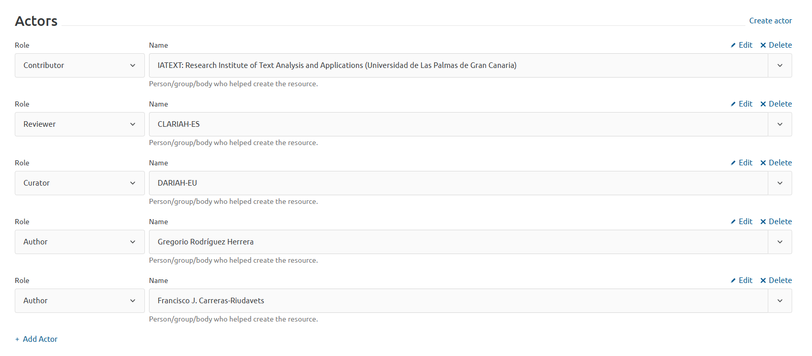
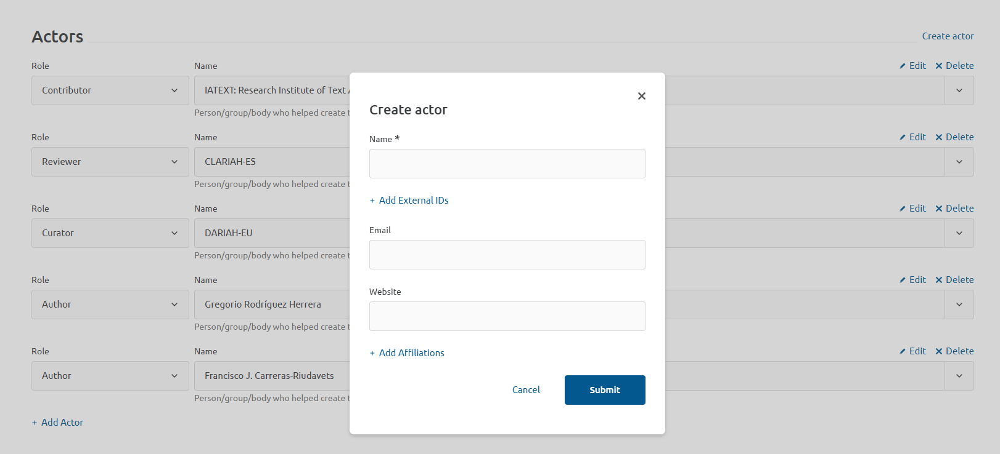

## Páxina 9

8 
 
IMPORTANTE: En el caso de la comunidad CLARIAH-ES, será obligatorio añadir en la 
categoría “Keyword” el valor “DARIAH Resource” 
 
Además, recomendamos cumplimentar los siguientes apartados (recuerda que 
puedes añadir tantas veces como quieras cualquiera de los metadatos para añadir 
nueva información): 
• 
Discipline: disciplina (o disciplinas) de estudio a la que se vincula el recurso. 
• 
Language: idioma o idiomas en el que está disponible el recurso. 
• 
Mode of use: forma en la que se utiliza el recurso (por ejemplo, acceso 
desde una web, aplicación móvil, etc.). 
• 
Intended audience: público al que está dirigido el recurso (por ejemplo, 
estudiantes, comunidad científica, etc.). 
• 
Keywords: incluye tantas palabras clave como sea posible, ya que esto 
aumentará las posibilidades de que el recurso aparezca en distintas 
búsquedas. Es recomendable consultar el enlace “Keywords from 
SSHOMP”, que aparece bajo la barra de opciones. Allí se pueden ver todas 
las palabras clave ya utilizadas en el SSH Open Marketplace. 
8) Media: se pueden añadir imágenes o vídeos. Recomendamos incluir capturas de 
pantalla de la página de inicio de la aplicación o del sitio web.

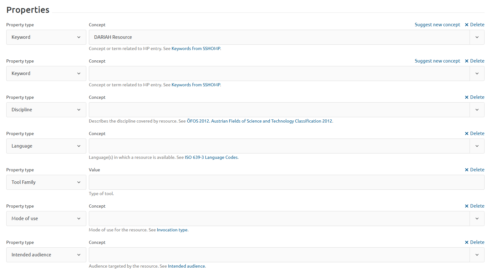
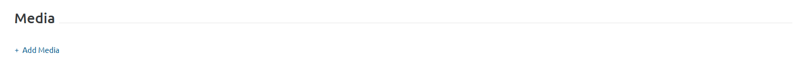

## Páxina 10

9 
 
9) Thumbnail: añadiremos un logotipo del recurso, en caso de que exista. Si no 
proporcionamos ninguno, aparecerá un logotipo genérico de SSH Open Marketplace. 
Se recomienda que el logotipo tenga una calidad de 200x200 píxeles. 
 
10) Related items: en este apartado se pueden indicar las relaciones que existan entre 
el recurso y otros elementos ya presentes en el SSH Open Marketplace. Por ejemplo, 
si hay un “Training Material” o un “Dataset” vinculado al recurso, puede especificarse 
aquí. Esto ofrece un contexto más amplio al usuario y facilita la navegación entre 
recursos relacionados dentro de la plataforma. 
 
11) Save as Draft o Submit: una vez hayamos cumplimentado el formulario, podremos 
hacer clic en el botón Submit para que sea enviado a los moderadores y ellos se 
encarguen de aprobarlo e incluirlo en la plataforma o no. Si no nos hemos decidido 
a publicarlo aún, podemos guardarlo como borrador al hacer clic en Save as Draft y 
acceder a él más adelante.  
 
 
Podremos acceder tanto a nuestros borradores como a nuestros elementos 
publicados en el apartado My Account.

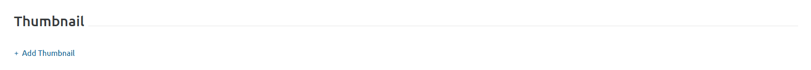
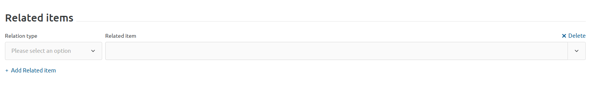
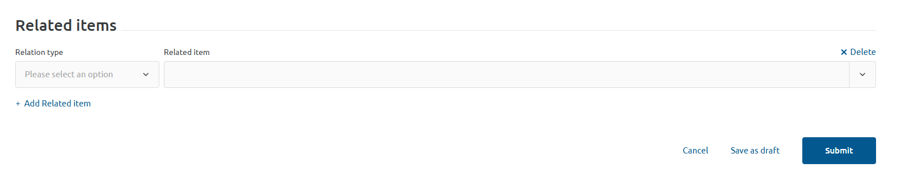
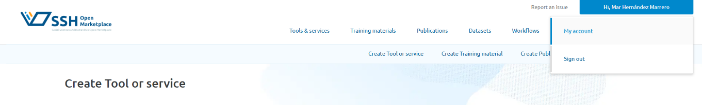

## Páxina 11

10 
 
 
Bibliografía 
SSH Open Marketplace. (s.f.). Metadata guidelines: Guidance for metadata fields. SSH Open 
Marketplace. Disponible en: https://marketplace.sshopencloud.eu/contribute/metadata-
guidelines#guidance-for-metadata-fields [consulta: abril de 2025]

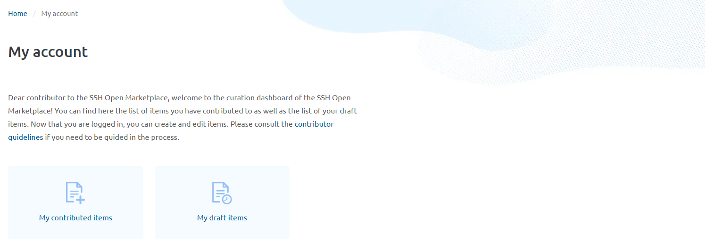